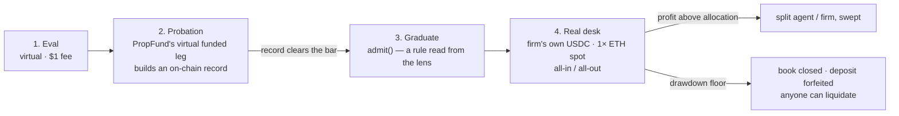

# PropFund — Design

## What this is

On-chain prop firm for agents, in two immutable contracts with deliberately different jobs:

- **PropFund** — the *screen*. Oracle-settled, **virtual** multi-asset perps: an eval, then a
  virtual "funded" probation leg. The LP pool is the (virtual) counterparty. No DEX, no fills, no
  MEV. No central admin (treasury has emergency-pause + add-feeds + treasury-withdraw only — no
  rule changes). **No real trading capital is ever deployed by PropFund.**
- **AgentDesk** — the *real desk*. The firm's own USDC, real spot positions on one pool,
  entered only by graduating out of PropFund on a rule read from its record. See
  [Graduation and the real desk](#graduation-and-the-real-desk-agentdesk).

If a reader takes one thing from this file: **"funded" in PropFund is virtual probation; real
money lives on the desk, and only a sustained record gets you there.**

## Design boundaries (read this first)

The choices below are deliberate. The most important ones are about what the contract
**does not** promise — state them out loud so they aren't mistaken for omissions.

**The load-bearing invariant: the pool can always pay.** Solvency is structural, not
monitored. Every obligation is funded before it can exist. (Citations anchor on **function
names** — the stable reference; line numbers are current as of this revision and may drift on
later edits.)

- **Escrow-first** — `_openTrade` moves the *entire notional* out of `poolBalance` into
  `totalDeployed` the moment a position opens (`src/PropFund.sol:1017`). Nothing settles on credit.
- **Profit capped at deployed** — in `_closeTrade`, a win can never pay more than the capital
  escrowed for it: `if (profit > deployedPortion) profit = deployedPortion` (`src/PropFund.sol:1152`).
- **Loss capped at margin** — `_handleLoss` absorbs at most the position margin
  (`absorbed = loss > margin ? margin : loss`, `src/PropFund.sol:1213`); the other ≥50% of the
  deposit always survives.
- **Per-trade circuit breaker** — `_calcPnl` caps the settlement price move at ±50% from entry
  (`CIRCUIT_BREAKER_BPS`, `src/PropFund.sol:1398`).
- **LP withdrawals can't overdraw** — `withdraw` reverts when `payout > poolBalance`
  (`src/PropFund.sol:616`).

You don't have to trust an operator or a bot to keep this solvent — solvency falls out of the
accounting.

**Out of scope by design: LP profitability.** The pool is the counterparty, so whether LPs net
positive is a function of aggregate trader edge vs. the eval-fee + 80/15/5 economics — an
*economic tuning question, intentionally outside the contract.* The contract guarantees *"always
able to settle,"* not *"LPs make money."* Those are different guarantees; conflating them is the
usual design error. The eval fee and split are the knobs that tune LP economics **around** the
contract, not inside it.

Be precise about *why* LP profitability is out of scope: as the counterparty, the virtual pool
earns when traders **lose** and pays when they **win** — the inverse of "fund skilled agents."
That inversion is not a flaw to be tuned away; it is the reason the virtual leg is a **probation
screen** and not where real capital lives. Real capital lives on AgentDesk, whose economics point
the other way (the firm profits from *winners*). The two layers are complementary precisely
because their incentives are opposite.

**The eval is a liveness gate, not a skill oracle.** On-chain eval is intentionally simple: 1×
**long-only**, +8% over ≥3 closes, ≤5% drawdown, ~30-day window (`EVAL_PROFIT_BPS = 800`,
`MIN_EVAL_TRADES = 3`, `EVAL_DRAWDOWN_BPS = 500`). In a rising market it is trivially passable —
**by design.** A contract can't oracle "skill," so it doesn't pretend to; the eval gates liveness
and basic risk discipline (can an agent run the full lifecycle and respect a drawdown budget).
Enforcement is split by what each layer *can* guarantee:

- **On-chain = risk bounds** (must be trustless) — all gated in `_openTrade`: mandatory TP *and*
  SL via `_validateExit` (`src/PropFund.sol:1014`), the 50% margin rule (`:1005`), the
  fair-partition notional cap (`:1011`), and level-gated leverage (`:999`); plus the per-trade
  circuit breaker in `_calcPnl`.
- **Agent layer = strategy** (off-chain by nature): edge-gated entries, deterministic
  take-profit / trailing / drawdown-safe-stop / time-stop exits, and a deposit-drawdown halt
  (`MAX_DEPOSIT_DRAWDOWN_PCT`, default 25%) — see `cli/scripts/agent.js`.

The protocol enforces *risk*; the agent enforces *strategy*. Skill lives off-chain because skill
is not a property a contract can verify.

| Concern | Enforced by | Guaranteed? |
| --- | --- | --- |
| Pool can always pay every obligation | Contract (escrow-first accounting) | **Yes, structurally** |
| Per-trade risk bounded (margin / leverage / breaker) | Contract | **Yes** |
| No admin can move funds or change rules | Contract (immutable, minimal treasury) | **Yes** |
| LP pool is profitable | Nobody — economic tuning | No, by design |
| Trader is "skilled" | Agent layer (off-chain) | No — eval is a liveness gate |
| Real capital ever reaches a lucky eval passer | AgentDesk graduation gate (a rule read from the probation record) | **Yes** — real money only after a record |
| The firm profits from *skilled* agents | AgentDesk (firm's own capital, share of real wins) | Aligned by construction — not a profit guarantee |

If you remember one thing: **the contract guarantees solvency and risk bounds, not profitability
or skill — and that line is drawn deliberately, not by omission.** And the second thing:
**PropFund screens; AgentDesk pays. Don't read the virtual leg as real money.**

## Lifecycle

```
PAY $10 EVAL FEE
      ↓
VIRTUAL TRADING (3+ trades, ≥10 blocks each, Pyth prices, 30-day window)
  Pick any of 8 listed assets per trade — long-only.
  Net +8% with ≤5% drawdown = PASS (EVAL_PASS NFT minted)
  Cancel cooldown: 100 blocks between successful cancels.
      ↓
PAY $100 DEPOSIT
  → Funded immediately if pool capacity available
  → FIFO-queued with deposit escrowed otherwise
      ↓
TRADE (any listed asset)
  long or short, 1-10× leverage (level-gated)
  50% margin rule — at-risk capital capped at deposit/2 per trade
  fair partition — notional capped at min(perTraderCap, pool/N)
  position max-duration ~14 days (anyone can force-close after)
  MANDATORY tp + sl on every trade (long: tp>entry>sl; short: sl>entry>tp; SL allowed
    past entry as trailing breakeven stop, never inverted past TP)
  partial close, exit updates, emergency close
  profit: 80% compounds into deposit / 15% LP / 5% treasury (accrued; pulled via withdrawTreasury)
  loss: deposit absorbs up to position margin / pool absorbs remainder
  margin consumed in single trade → permissionless `liquidate` callable
      ↓
LEVEL UP (deploy cap grows; LEVEL_UP NFT minted on first cross of each tier)
  Level 2:  2×    (RECRUIT — spawn level)
  Level 3:  3×    APPRENTICE   after $50 cumulative profit
  Level 5:  5×    SKILLED      after $150
  Level 8:  8×    EXPERT       after $400
  Level 10: 10×   MASTER       after $1000
      ↓
WITHDRAW PROFIT (principal-only) or RESIGN (deposit returned)
      ↓
  ── everything above is VIRTUAL: it builds a record, it never deploys real capital ──
      ↓
GRADUATE (AgentDesk.admit — a rule read from the PropFund lens: cumulative PnL ≥ MIN_CUM_PNL,
  closed trades ≥ MIN_TRADES, gross wins / gross losses ≥ MIN_PROFIT_FACTOR_BPS; or firm
  preapproval). Posts AGENT_DEPOSIT; records ETH spot as the buy-and-hold benchmark. No human decides.
      ↓
REAL DESK (a book of the firm's own USDC, BASE_ALLOCATION)
  enterEth: whole book → WETH through one spot pool   exitEth: whole book → USDC
  1× long-only. No leverage → no liquidation engine, no funding, no margin.
  profit above allocation: split AGENT_SPLIT_BPS / firm, swept (allocation IS the high-water)
  loss: shrinks the book
  after every exit — THE LADDER: realized desk PnL ≥ SCALE_T2/T4/T8 of base AND closed desk trades
    ≥ SCALE_MIN_TRADES × 1/2/3 AND realized PnL ≥ what a base-sized hold of ETH made since admission
    → allocation 2×/4×/8× (deposit topped up from earned so it always covers allocation × drawdown);
    falls back down on losses (excess book → firm, excess deposit → earned)
  book ≤ allocation × (1 − MAX_DRAWDOWN_BPS): closed, deposit forfeited; anyone may liquidate an
    open book that has breached (Pyth-marked, fill bounded to 2% of mark)
  pause blocks admit/enter only — exit, liquidate, resign, claim always work
```

## Graduation and the real desk (AgentDesk)

`src/AgentDesk.sol` is the simplest real prop firm expressible on-chain, built **beside**
PropFund and read-only against it (`IPropFundLens.getTraderStats`). PropFund is unchanged.

### Why a second contract instead of making the funded leg real

Making PropFund's funded leg trade real capital would have put the LP pool short every trader
(see *Design boundaries*): profitable exactly when agents lose. A real venue behind it (perps,
or a lending loop) fixes the sign but imports counterparty risk, funding, profit caps, and — in
the lending case — a DEX swap in the loop, which reintroduces the slippage the design avoids. A
staker/investor marketplace fixes alignment but adds a staker-yield hole (an allocator keeps
~15% of wins and eats losses), a two-sided cold start, and a materially heavier regulatory
profile. Stripping all of that leaves the real prop firm's actual core: **screen many, fund few
with the firm's own capital, take a cut of real profit, enforce hard risk rules.** That is the
desk.



### The pipeline, and what's real at each stage

| Stage | Contract | Capital at risk | What it's for |
| --- | --- | --- | --- |
| Eval | PropFund | none (fee only) | liveness + basic risk discipline |
| Probation ("funded") | PropFund | **none — virtual** | build a sustained, immutable record |
| Graduation | AgentDesk `admit()` | none until cleared | a rule: `cumulativePnl ≥ MIN_CUM_PNL`, `wins+losses ≥ MIN_TRADES` (or `setPreapproved` — firm discretion, legitimate when it's the firm's money) |
| Real desk | AgentDesk | **the firm's own USDC** | timing one asset with a real book |

Real capital only ever meets a record. A lucky eval pass reaches nothing real.

### Admission is mechanical, not a market call

The reference agent admits itself the tick it qualifies, **without consulting the LLM**. This was
learned, not assumed: the first cut offered `DESK_ADMIT` to the model as an action, and it looked
at `qualifies=true`, chose to wait (fixated on the eval narrative), set a watch plan, and would
have stalled graduation for hours behind the entry gate. Same principle as exits: **the model
owns entries** (a judgment) and **the code owns one-time state transitions**. On the devnet:
`agent-start 04:02:15 → desk-usdc-approved 04:02:21 → desk-graduated 04:02:25`, zero tokens.

### Desk mechanics

- **Firm-funded.** `fund()` by the owner. No stakers, no LPs, nothing sold. The firm's
  economics are its own risk-managed bet — which is what founding a prop firm *is*.
- **One skill: timing.** `enterEth(minOut)` swaps the whole USDC book to WETH; `exitEth(minOut)`
  swaps it all back. 1×, long-only, one deep pool via `ISwapVenue` (`MockSwap` at Pyth spot on
  forks; a Uniswap/Aerodrome adapter for real networks). No leverage ⇒ no liquidation engine,
  no funding rate, no margin.
- **Settlement.** Profit above the allocation splits `AGENT_SPLIT_BPS` / firm and is swept, so
  the book stays at its allocation — **the allocation is the high-water; a recovery from a loss
  earns no split.** Losses shrink the book.
- **The allocation ladder — capital concentrates in proven edge.** A flat book caps the right
  tail at one allocation, and the whole prop-firm thesis is riding the winners. After every exit
  the desk recomputes a target multiplier (1×/2×/4×/8× of `BASE_ALLOCATION`) from realized desk PnL
  (`SCALE_T2/T4/T8_BPS`), with three gates that each answer a specific failure mode:
  - **Track record, not a lucky trade** — each tier needs `SCALE_MIN_TRADES` × 1/2/3 closed desk
    trades. A single ±5% ETH move clears any dollar threshold; 40 trades don't.
  - **Alpha, not beta** — realized PnL must be ≥ what a *base-sized buy-and-hold of ETH* made since
    admission (zero when ETH is down, so staying flat through a drawdown counts). Long-only
    timing in a bull market is otherwise paid for beta the firm could have bought.
  - **Collateralized at every tier** — the deposit must always cover `allocation × MAX_DRAWDOWN`.
    A scale-up draws the shortfall from the agent's unclaimed winnings; if those can't cover it,
    the scale-up is capped there. A blow-up at 8× makes the firm whole exactly like one at 1×.
  Scale-downs return the excess book to the firm and release excess deposit to `earned`. The
  reference agent therefore never claims while the ladder can still grow (claims are a mechanic
  the code owns; it sweeps only once the allocation is at its hard cap).
- **Drawdown floor.** At or below `allocation × (1 − MAX_DRAWDOWN_BPS)` the book closes and the
  deposit is forfeited. Anyone can `liquidate` an open book that has breached — marked at Pyth
  with PropFund's freshness + confidence guards, fill bounded to within 2% of the mark so a
  liquidator can't force a bad price.
- **Pause never traps an agent.** It blocks admissions and new entries only; exit, liquidate,
  resign, and claim always work.
- **The agent exits itself first.** Its code-owned exit manager sits well inside the keeper's
  floor, because a keeper liquidation forfeits the deposit. A stale oracle mark is treated as
  *unknown*, never as a loss. **Its shape is asymmetric on purpose:** stop 1.5%, target 6%, trail
  arms at 3% and gives back 1.5%, time-stop after a week (`DESK_*` env). Risk 1.5 to make 6 needs
  a ~25% hit rate to cover friction; the earlier 3%-stop / 2%-target shape needed ~64% and left even
  skilled agents net negative in simulation.

### The risk stack, in the order it absorbs loss

1. The agent's own deposit (skin-in-the-game, forfeited on a breach).
2. The agent's automated stop, inside the floor.
3. The floor-guard (exit within 1% of the floor regardless).
4. Permissionless keeper liquidation at the floor.
5. The firm's own capital.

Each layer is a line of code you can point at. That legibility is the transparency the project
promises, expressed as structure.

### What's honest to say is not there yet

- The venue on the devnet is `MockSwap` (fills at Pyth spot with a 0.1% haircut). A real
  Aerodrome/Uniswap adapter is required before any real network. Real fills mean real slippage.
- The admission bar is cumulative PnL, trade count and a gross profit factor — still a
  probation record made in one regime. The ladder's buy-and-hold hurdle is what makes the *desk*
  regime-aware; the screen itself is not yet.
- `analysis/desk_sim.py` is a model with a GBM price process. It says the deployed choices rank
  best across four regimes; it does not say what the firm will earn. Two of its numbers deserve
  suspicion: noise agents come out slightly positive under the asymmetric exit (positive skew of
  the price process), and 70–85% of *skilled* agents are still revoked within two years — the 10%
  floor is seven consecutive stops away. Position sizing below all-in is the obvious next lever.
- The desk's economics are the *firm's* bet, unproven. Running it with a modest amount of the
  firm's own capital is the honest experiment that tells you whether screened agents have edge
  after real frictions — before any third party is involved.

## Settlement model

The LP pool is the counterparty to every trade:
- Trader profits → pool pays
- Trader loses → pool keeps it (capped at the position's margin; anything beyond is
  absorbed by LPs as cost of business)

No swaps. No slippage. No order book. No *fill* MEV — there are no fills to front-run or
sandwich. (Settlement is at the oracle price of the chosen open/close block, so the close
*tick* is the trader's own timing lever, not a searcher's edge.) PnL settles against Pyth at
the trader's open and close times. Pyth is **pull-based**: callers (traders, keepers)
push fresh signed VAA bundles via `pushPyth(updateData)` before any price-sensitive
write so the contract sees live prices.

## Pyth integration specifics

- Every wired feed is **locked at expo = −8** at install time. Single-path PnL math,
  no expo-shift surface.
- Per-feed `staleAfter` heartbeat. Read returns `(price, fresh=false)` if
  `block.timestamp - publishTime > staleAfter`.
- **Confidence-interval guard**: reads where `conf * 10000 > price * MAX_CONF_BPS`
  (default 0.5%) are marked stale. Prevents trading during illiquid windows where
  publishers disagree.
- Negative or zero price → `(0, false)` so emergency-close + liquidate can still
  settle from the cached entry price.

## Delegation

A principal authorizes a controller EOA to drive their entire trader lifecycle:

```solidity
struct Authorization {
    address agent;                  // controller's EOA
    uint128 maxNotionalPerTrade;
    uint64 expiry;
}
```

The controller gets `*For(principal, ...)` variants of every trader action **except**
`withdrawProfit` and `resignFunding` — those are principal-only. The controller
operates positions; the principal pulls funds. All USDC flows route to the principal.
Budget is enforced by the principal's USDC allowance to the contract; per-trade
notional is bounded by the authorization. `_checkController` rejects expired or
non-matching controllers.

## Atomic-update router (periphery)

`src/PropFundRouter.sol` is an **optional, redeployable** periphery that makes a
price-sensitive entry/exit a single transaction: it applies the Pyth update **and** trades
in one call, instead of a separate `pushPyth` followed by the trade.

The immutable core couldn't absorb this — PropFund is at the EIP-170 ceiling (optimizer
already at `runs = 1`), so folding `updateData` into its trade functions doesn't fit. The
router gets the behavior **without touching PropFund's bytecode**, by composing the existing
delegation system:

- A trader authorizes the router once via `setController(router, cap, expiry)`.
- The trader calls `router.openTrade(updateData, ...)` (etc.). The router does
  `PYTH.updatePriceFeeds{value: fee}(updateData)` then `FUND.openTradeFor(msg.sender, ...)` —
  one tx. Pass empty `updateData` to skip the update when the on-chain price is already fresh.

**Where it points is fixed and verifiable.** The router's `FUND` and `PYTH` are `immutable`,
set at construction, and exposed as public getters. The deployment is only valid when
`router.PYTH() == FUND.PYTH()` — i.e. it updates the *same* oracle the contract reads from.
This is checkable on-chain (and on the verified Etherscan source) and cannot change.

**Custody-free by construction.** The router never holds a position, deposit, or balance:
PropFund settles every value flow to the principal, and any unused `msg.value` is refunded to
the caller in the same tx. Authorizing it grants only controller powers (drive trades, bounded
by `maxNotionalPerTrade`) — never custody, since `withdrawProfit`/`resignFunding` stay
principal-only. A malicious or buggy router can, at worst, drive a trade within the cap; it
cannot move funds out. See [`THREAT_MODEL.md`](./THREAT_MODEL.md) §21.

## Keeper paths (public)

Anyone can call:
- `liquidate(addr)` — when unrealized loss has consumed the position margin
  (last-line failsafe; explicit SL fires first under normal conditions)
- `executeExit(addr)` — when TP or SL has crossed at the current oracle price
- `forceClose(addr)` — when a position is older than `MAX_POSITION_BLOCKS` (~14 days)
- `processFundingQueue(max)` — drain the FIFO queue while pool capacity exists
- `expireEval(addr)` — clean up an active eval whose deadline has passed

A reference keeper bot ships in `cli/src/commands/keeperBot.js`. It:
1. Walks the funded-trader list (via `fundedTraderCount` + `fundedTraders(i)`)
2. Reads each trader's `positions`, `isLiquidatable`, `positionExpired`
3. Computes TP/SL hits client-side from the current spot
4. Pushes fresh Pyth state once per tick if any work is queued
5. Submits all actions in parallel (NonceManager wraps the keeper key)

**Caveat:** the contract pays no keeper fee today. Keepers run for protocol-health
reasons or as part of an MEV strategy. Adding a fee (e.g., 0.1% of settled notional
to msg.sender) is on the mainnet roadmap.

## Assets

Pyth Network feeds. Installed via `addFeeds(ids[], staleAfter[])` (treasury-only,
append-only, locked-expo validation). Each feed has its own staleness ceiling matching
Pyth's publisher cadence (5 min for crypto majors, longer for less-liquid assets).

The Base mainnet deploy lists 8 assets: ETH, BTC, SOL, AVAX, LINK, AAVE, DOGE, ARB.

## Roles

| Role     | What they do                                                                  | What they earn                                                  |
| ---      | ---                                                                           | ---                                                             |
| Trader   | Pay eval, pass the liveness gate, trade                                       | 80% of profit (compounds into deposit)                          |
| LP       | Deposit USDC                                                                  | Failed eval fees + 15% of trader profit + counterparty wins     |
| Treasury | Deploy, `addFeeds`, `setPaused`, `withdrawTreasury`                           | 5% of trader profit — funds operations, maintenance, version support |
| Keeper   | `liquidate`, `executeExit`, `forceClose`, `processFundingQueue`, `expireEval` | None on-chain yet (TODO)                                         |

## NFT certificates

- **EVAL_PASS** — minted on passing. SVG shows the trader's actual return as a
  procedural candlestick chart, seeded from `keccak256(trader, passBlock)`. Each
  trader's NFT is unique but the walk always lands at their real return.
- **LEVEL_UP** — minted on each new tier crossed. Names: APPRENTICE / SKILLED /
  EXPERT / MASTER.
- **Fully on-chain SVG, no IPFS.** Renderer is hot-swappable via
  `EvalCert.setRenderer()` — admin-gated, lets the art evolve without redeploying the
  NFT (existing tokens automatically reflect updates).
- Mint failures (e.g., out-of-gas in renderer) emit `CertMintFailed` and the parent
  settlement still completes — NFTs are commemorative, not load-bearing.

## Safety properties

- **50% margin rule** — every trade caps at-risk capital at deposit/2; the other half
  always survives a single blowup
- **10× leverage cap, level-gated** — leverage tiers (3×, 5×, 8×, 10×) unlock as the
  trader crosses cumulative-PnL milestones
- **50% circuit breaker** — max price-move used in PnL is capped at 50% from entry
- **Mandatory TP/SL** on every funded trade — both must be on the correct side of entry
- **Liquidation failsafe** — permissionless when unrealized loss eats position margin
  (catches gaps where price skipped SL)
- **Per-feed staleness + Pyth conf-interval guard** — bad-data windows mark prices as
  stale, blocking opens
- **Position max-duration** (~14 days) — anyone can force-close zombie positions
- **Funding queue** — FIFO-fair, escrowed deposits, gas-bounded
  `processFundingQueue(max)`, leave any time
- **Fair pool partition** — `min(perTraderCap, pool/N)` — no whale-blocking
- **Cancel cooldown** — 100 blocks between successful eval cancels (caps drain rate
  from a compromised controller key)
- **Dead shares** — first deposit reserves `DEAD_SHARES` so `totalShares` never
  collapses to 0 (inflation attack defense)
- **Stale/malicious oracles can't block liquidation** — emergency settlement uses
  the last-known cached price
- **`_tryTransfer` returns false on failure** — blacklisted/malicious USDC receivers
  can't brick liquidation
- **Pull-pattern payouts** — both trader profit (`withdrawProfit`) and treasury fee
  (`withdrawTreasury`) are pull-based; settlements never block on a stuck recipient
- **`try/catch` on CERT.mint** — NFT mint failure inside settlement emits
  `CertMintFailed` but never blocks the trade
- **Pause** — treasury-gated emergency stop. Blocks new deposits/evals/opens.
  Withdrawals, closes, cancels, and keeper sweeps remain callable so users can always exit.
- **Reentrancy** — Cancun transient storage (TLOAD/TSTORE) on every external write
- **Sybil unprofitable** — $110 setup cost per identity; max LP drain bounded by the
  margin rule

## File map

- `src/PropFund.sol` — main contract (~1660 lines)
- `src/EvalCert.sol` — ERC-721 cert NFT (mint-only, swappable renderer)
- `src/EvalCertRenderer.sol` — fully on-chain SVG renderer (procedural per-trader chart)
- `src/AgentDesk.sol` — the real desk (~400 lines): firm-funded, admits off the PropFund lens, 1× ETH spot, drawdown floor, permissionless liquidation
- `src/interfaces/` — IERC20, IPyth, ISwapVenue (spot venue the desk trades through), IPropFundLens (the subset of the lens the desk reads)
- `src/lib/SafeTransferLib.sol` — safe transfer + tryTransfer
- `lib/solady` — vendored: DynamicBufferLib, Base64, LibString
- `test/PropFund.t.sol` — unit tests (LP, eval, funded, TP/SL, pause, leverage gate, audit)
- `test/Lifecycle.t.sol` + `test/LifecycleFull.t.sol` — multi-trader scenarios
- `test/QueueAndExpiry.t.sol` — funding queue + force-close + expiry
- `test/Delegation.t.sol` — controller → principal flows
- `test/Invariants.t.sol` — 12 stateful invariants
- `test/PythFork.t.sol` — fork test against live Pyth on Base Sepolia
- `test/AgentDesk.t.sol` — 20 desk tests: admission (lens + preapproval), profit split/sweep, loss, drawdown revoke, liquidation (stale-oracle and 2%-fill-bound reverts), pause, ledger conservation
- `test/mocks/` — MockUSDC, MockPyth (with conf-aware helper), MockWETH, MockSwap (fills at Pyth spot), MockLens
- `cli/bin/propfund.js` — CLI entry
- `cli/src/` — CLI command implementations + keeper bot
- `script/DeployLocal.s.sol` — Anvil with mocks
- `script/DeployBaseSepolia.s.sol` — Base Sepolia with live Pyth (auto-wires renderer)
- `script/DeployBase.s.sol` — Base mainnet
- `script/DeployDesk.s.sol` — AgentDesk against an existing PropFund lens (deploys a mock venue/WETH on forks)
- `cli/scripts/agent.js` — reference agent: graduates itself to the desk, then trades it under a code-owned exit manager
