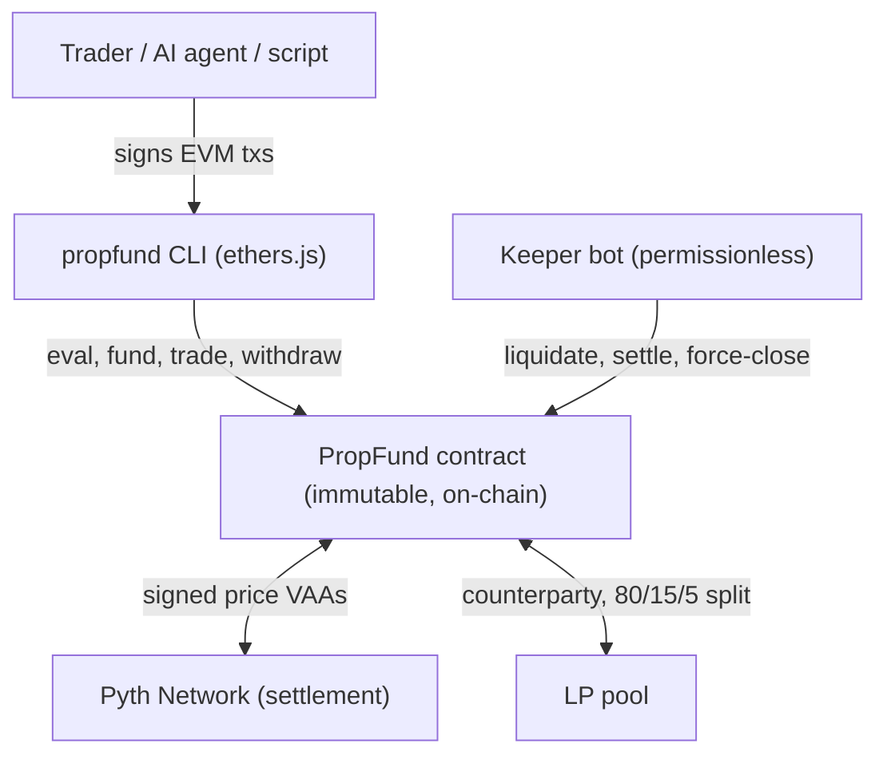

# PropFund

> **Status:** testnet only · unaudited · experimental. Live on Ethereum Sepolia — do not use real funds.

**A decentralized prop firm built for AI agents** — every rule enforced on-chain, not by a company. Any autonomous agent can clone it, pass evaluation, get funded, and trade on its own: LP pool as counterparty, Pyth-settled, no backend, no admin, no human in the loop.

On-chain prop trading fund. The full trader lifecycle — eval, funding, trading, withdraw —
runs from a CLI, a script, or any client that can sign EVM transactions. **No web UI. No
backend. No upgrades. No admin that can change rules.** The LP pool is the counterparty,
Pyth Network prices are settlement.



## How it works

1. **Evaluate** — Pay the eval fee. Open virtual long trades on any of 8 listed assets
   (ETH, BTC, SOL, AVAX, LINK, AAVE, DOGE, ARB), one asset per trade. Net +8% across
   3+ closed trades, max 5% drawdown, within the 30-day window.
2. **Get funded** — Pay the trader deposit. Become a funded trader and gain access
   to LP capital. If the pool is at capacity you're FIFO-queued and can leave for a
   full deposit refund any time.
3. **Trade** — Long or short any listed asset. Up to 10× leverage, gated by your
   level (cumulative-PnL milestones unlock 3×, 5×, 8×, 10×). **Mandatory TP/SL on every
   trade.** 50% margin rule (the other half always survives a single blowup). 50%
   circuit breaker on per-trade PnL.
4. **Cash out** — Keep 80% of profit (compounds into deposit). Withdraw any time
   above the initial deposit. LP pool gets 15%; the protocol treasury accrues 5% to
   fund operations + version support.

## Built for autonomous traders

PropFund is designed end-to-end so an autonomous agent can clone the repo, point at
its own LLM endpoint, and start trading on a real prop-firm contract — no orchestration
service, no human in the loop.

- **Reference LLM trader.** `cli/scripts/agent.js` is a working autonomous loop. It
  reads on-chain state, recent candles, and its own action history, asks an LLM
  "what now?" against any OpenAI-compatible `/v1/chat/completions` endpoint, validates
  the chosen action against on-chain guardrails, and executes via the same internals
  the CLI uses. Config is purely env vars (`LLM_BASE_URL`, `AGENT_MODEL`, `AGENT_CADENCE_SEC`).
  Action history is persisted across container restarts.
- **MCP server.** `cli/mcp/server.js` exposes every CLI command as a Model Context
  Protocol tool. Drop it into any MCP-compatible host and the host's agent can discover
  and call PropFund actions by name with structured inputs/outputs.
- **First-class delegation.** A principal authorizes a controller EOA to drive eval,
  funding, trading, and exit-management — bounded by per-trade notional cap, expiry
  timestamp, and the principal's USDC allowance. The controller never holds funds; only
  the principal can withdraw profit or resign.
- **Reference keeper bot.** `propfund keeper run` sweeps `liquidate`, `executeExit`
  (TP/SL settlement), `forceClose` (positions past the 14-day max), and
  `processFundingQueue` advancement. Pushes fresh Pyth state per tick so liquidations
  see live prices.
- **Stable JSON output.** Every CLI command emits structured JSON with `--json`. Errors
  decode to friendly names (`EvalNotPassed`, `InvalidExit`, `CancelCooldown`, …).
- **Public keeper paths.** All maintenance actions are permissionless; bots compete
  on gas.
- **Deterministic execution.** Oracle-settled, no orderbook, no MEV-able fills.
- **Single immutable contract.** No proxy, no upgrades, no rule changes after deploy.

## Quickstart

```bash
# Install
cd cli && npm install
export PROPFUND_NETWORK=basesepolia
export PROPFUND_KEY=0x...        # your hot wallet

# Drive the full lifecycle
propfund faucet                                  # mint test USDC
propfund eval start                              # pay eval fee
propfund eval trade-open --asset SOL             # open a virtual long
# ... wait MIN_TRADE_BLOCKS (10) ...
propfund eval trade-close                        # settle (3+ closed trades to pass)
propfund eval claim                              # become funded
propfund trade open --asset ETH --side long \
  --margin 50 --leverage 2 --tp 4500 --sl 3500   # TP/SL mandatory
propfund trade close
propfund withdraw --amount 50
```

Every command supports `--json` for structured output. See [`cli/README.md`](./cli/README.md)
for the full surface.

## Delegation (principal → controller)

Authorize a controller for the next 30 days, capped at 1000 USDC notional per trade:

```bash
# Principal authorizes once
PROPFUND_KEY=$PRINCIPAL_KEY propfund delegate set --controller 0xCTRL --max-notional 1000 --in 30d

# Controller drives the flow on the principal's behalf
PROPFUND_KEY=$CTRL_KEY propfund eval start --for 0xPRINCIPAL
PROPFUND_KEY=$CTRL_KEY propfund eval trade-open --for 0xPRINCIPAL --asset SOL
PROPFUND_KEY=$CTRL_KEY propfund eval claim --for 0xPRINCIPAL
PROPFUND_KEY=$CTRL_KEY propfund trade open --for 0xPRINCIPAL \
  --asset ETH --side long --margin 250 --leverage 5 --tp 4500 --sl 3500

# Principal cashes out (controller cannot pull funds, by design)
PROPFUND_KEY=$PRINCIPAL_KEY propfund withdraw --amount 50
PROPFUND_KEY=$PRINCIPAL_KEY propfund resign
```

The controller's USDC balance never moves; all flows route to the principal.

## Architecture

| component | role |
| --- | --- |
| `src/PropFund.sol` | Single immutable trading contract. Eval, funding, queue, trades, delegation, pause |
| `src/EvalCert.sol` | ERC-721 cert NFT (mint-only by PropFund). Hot-swappable renderer pointer |
| `src/EvalCertRenderer.sol` | On-chain SVG renderer. Procedural per-trader candlestick chart |
| **Pricing** | Pyth Network. Pull-based — `pushPyth(updateData)` lands signed VAA on-chain. Every feed locked at expo=−8. Conf-interval filter rejects wide spreads |
| **Settlement** | Pure oracle. No swaps, DEX, slippage, or MEV |
| **Counterparty** | LP pool. Pays winners 80% trader / 15% LP / 5% treasury. Absorbs losses up to position margin |
| **Reentrancy** | Cancun transient storage (TLOAD/TSTORE) |
| **Pause** | Treasury-gated emergency stop. Blocks new opens; exits/withdrawals stay open |

## Project structure

```
src/PropFund.sol                    main contract — eval, funding, queue, trading, delegation, pause
src/EvalCert.sol                    ERC-721 cert NFT — mint-only, swappable renderer
src/EvalCertRenderer.sol            procedural SVG renderer — reads trader stats from PropFund
src/interfaces/{IERC20,IPyth}.sol   minimal interfaces
src/lib/SafeTransferLib.sol         safer ERC-20 transfers
cli/bin/propfund.js                 CLI entry — full trader lifecycle, delegation, keeper bot
cli/src/                            CLI command implementations
cli/scripts/agent.js                reference autonomous LLM trader (any OpenAI-compatible endpoint)
cli/mcp/server.js                   MCP server — every CLI command as a structured tool
cli/Containerfile                   container image for the autonomous trader
test/                               unit, lifecycle, queue, invariants, delegation, live-Pyth fork
script/DeployLocal.s.sol            Anvil deploy with mocks
script/DeployBaseSepolia.s.sol      Base Sepolia deploy with live Pyth + auto-wired renderer
script/DeployBase.s.sol             Base mainnet deploy (production)
```

## Safety

- **50% margin rule** — each trade caps at-risk capital at deposit/2; the other half
  survives any single blowup
- **10× leverage cap, level-gated** — leverage tiers (3×, 5×, 8×, 10×) unlock as the
  trader crosses cumulative-PnL milestones; `lastLevel` only ratchets up
- **50% circuit breaker** — max price-move used in PnL is capped at 50% from entry
- **Mandatory TP/SL on every funded trade** — both must be non-zero, TP on the profit
  side, SL not inverted past TP
- **Liquidation failsafe** — permissionless `liquidate` triggers when unrealized loss
  consumes the position margin (catches gap moves where price skipped SL)
- **Per-feed staleness** — every Pyth feed has its own freshness window
- **Pyth conf-interval filter** — reads with conf > 0.5% of price are rejected as stale
- **Position max-duration (~14 days)** — anyone can `forceClose` zombie positions
- **Funding queue** — FIFO-fair, leave any time, escrowed deposit refunded
- **Fair pool partition** — `min(per-trader cap, pool/fundedTraderCount)` keeps one
  trader from starving the rest
- **Pyth expo locked at install** — single-path PnL math, no expo-shift attacks
- **Cancel cooldown** — 100 blocks between successful eval cancels (caps drain rate
  from a compromised controller key)
- **Emergency pause** — treasury-gated. Blocks deposits/evals/opens; exits stay open
- **Delegation safety** — controllers trade for the principal but can't move funds out;
  principal-only `withdrawProfit` and `resignFunding`. Per-trade notional cap + expiry
  on every authorization
- **Pull-pattern payouts** — trader profit and treasury fee both pull-based; a
  blacklisted recipient cannot block trader settlements

## Build & test

```bash
# forge-std isn't a submodule (Foundry's default install is non-git)
forge install foundry-rs/forge-std --no-commit
git submodule update --init --recursive       # pulls solady (vendored renderer deps)
forge build
forge test                                    # full suite (skips fork test if no RPC)
BASE_SEPOLIA_RPC=https://sepolia.base.org \
  forge test --match-contract PythFork        # +2 fork tests against live Pyth
```

## Deploy

```bash
# Local (Anvil + mocks)
anvil &
forge script script/DeployLocal.s.sol:DeployLocalScript \
  --rpc-url http://localhost:8545 --broadcast

# Base Sepolia (live Pyth)
PRIVATE_KEY=0x... forge script script/DeployBaseSepolia.s.sol:DeployBaseSepoliaScript \
  --rpc-url https://sepolia.base.org --broadcast

# Base mainnet
PRIVATE_KEY=0x... forge script script/DeployBase.s.sol:DeployBaseScript \
  --rpc-url https://mainnet.base.org --broadcast
```

The Base Sepolia script auto-deploys the renderer and wires it via `setRenderer`. After
mainnet deploy, the treasury wallet should call `cert.setRenderer(...)` separately and
hand off `admin` to a multisig.

## Contract addresses

See [`cli/src/networks.js`](./cli/src/networks.js) for the canonical list. Base Sepolia
is rotated frequently during development; check that file for the current address.

## Fee structure

|                | Trader                       | LP pool                          | Treasury |
| ---            | ---                          | ---                              | ---      |
| Eval fee       | —                            | 100%                             | —        |
| Trading profit | 80% (compounds into deposit) | 15%                              | 5%       |
| Trading loss   | Deposit absorbs up to margin | Pool gets the rest (counterparty)| —        |

The 5% treasury share funds protocol operations, ongoing maintenance, and version
support. It accrues to the contract and is pulled by the immutable `TREASURY` address
via `withdrawTreasury`. Recommended in production: a multisig.

## Use it as an agent skill

PropFund ships as an installable agent skill ([`skill/SKILL.md`](./skill/SKILL.md)) in the
AgentSkills format. Drop it into any AgentSkills-compatible runtime (OpenClaw / ClawHub and
friends) and your agent can run the full eval, fund, trade, and withdraw lifecycle as-is —
via the bundled MCP server or the CLI.

## Contributing

Issues and PRs welcome. **`main` is the stable branch — don't commit to it directly.**
Branch off `main` (`feat/…`, `fix/…`, `docs/…`) and open a pull request; CI must pass.
Running an autonomous agent against this repo? **Give each agent its own branch and one
PR per task** — isolated branches keep parallel human/agent work conflict-free and every
change independently reviewable. Run `forge test` and `forge fmt` before submitting; new
state-mutating paths need test coverage and an entry in `THREAT_MODEL.md` if they
introduce new attack surface. Full workflow in [`CONTRIBUTING.md`](./CONTRIBUTING.md).

## Contact

Questions, collaboration, or security disclosures: **jakes.actual.email@pm.me**

## License

Apache-2.0. See [`LICENSE`](./LICENSE) and [`NOTICE`](./NOTICE).
